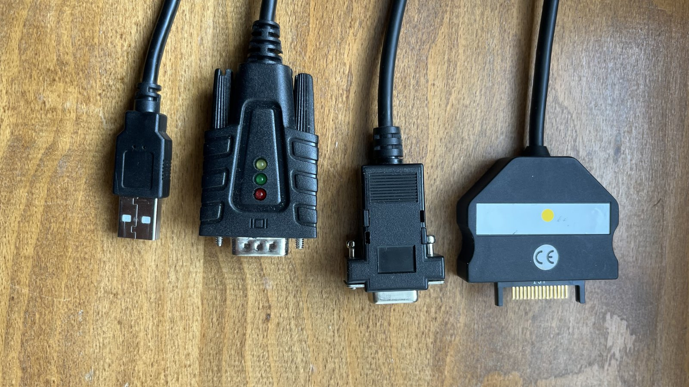
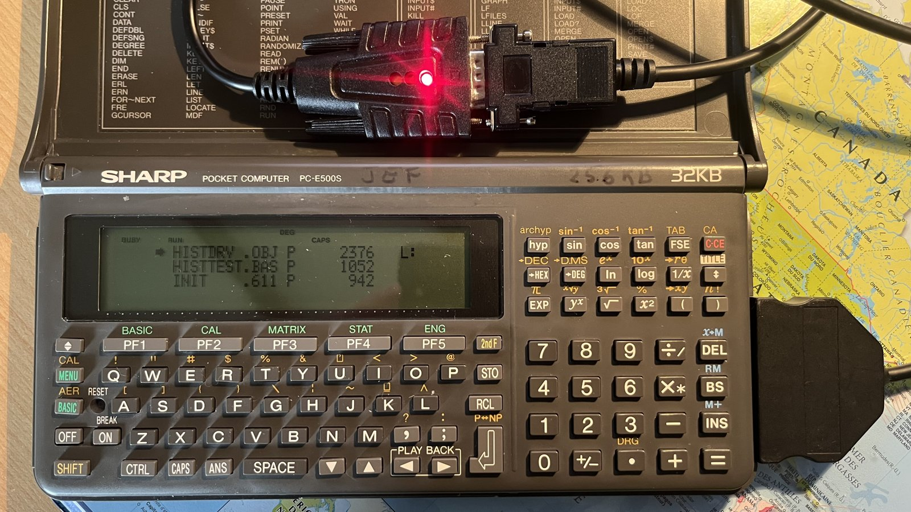
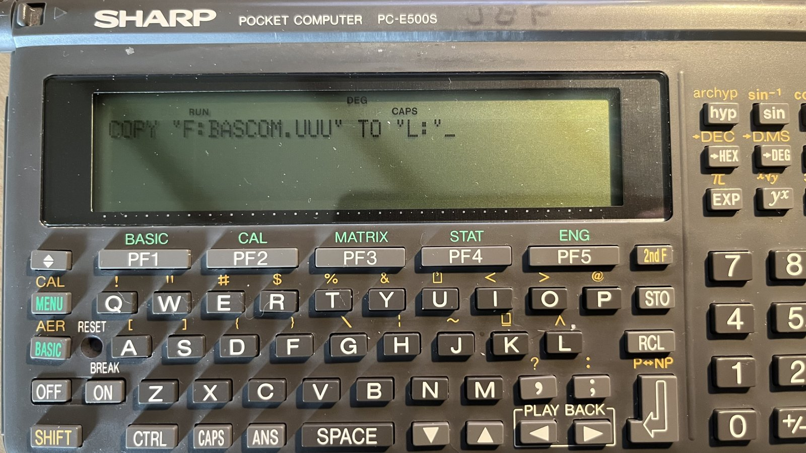
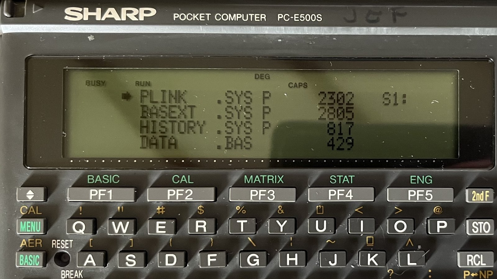
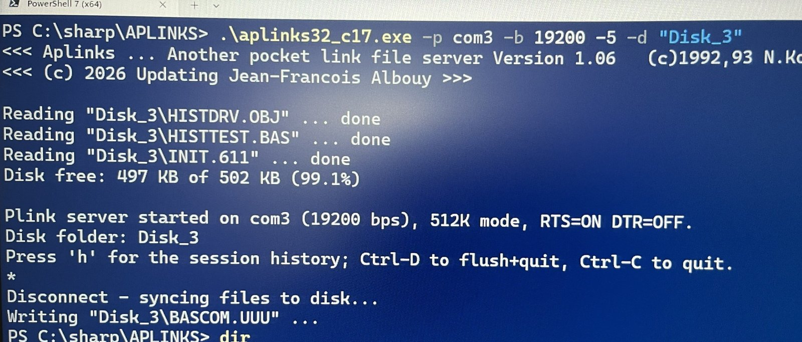
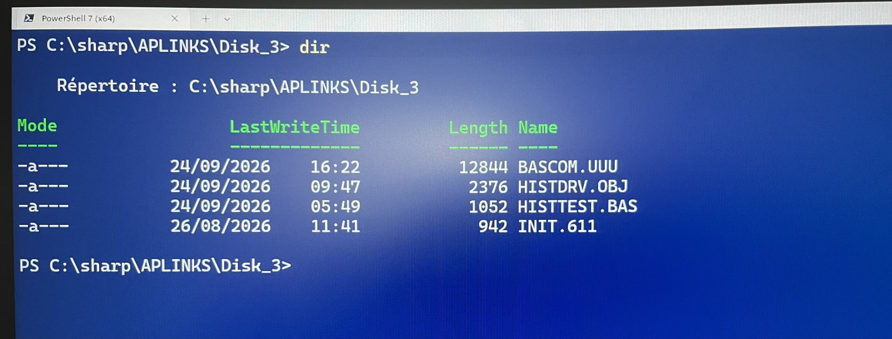

# Sharp PC-E500 — Pocket Link System (PLINK / PLINKC / APLINKS)

[🇬🇧 English](README.md) · **🇫🇷 Français**

Préservation et modernisation du **Pocket Link System**, une famille de logiciels
libres japonais des années 1990 qui transforme un ordinateur de poche **Sharp
PC-E500** en client d'un PC via un câble série. Le pocket voit un lecteur de
disque ordinaire **`L:`** — mais ce lecteur n'a aucun stockage physique : chaque
secteur lu ou écrit est transporté par la liaison série jusqu'à un petit
**programme serveur tournant sur le PC**, où les fichiers existent réellement.

Ce dépôt conserve les **archives d'origine intactes** (`original/`) et ajoute un
**serveur modernisé et portable** et un **pilote mis à jour**, qui dialoguent
encore avec du vrai matériel en 2026 (`modernized/`).

```
   Sharp PC-E500(S)                         PC (Windows / Linux / macOS)
  ┌────────────────┐   9600–19200 bps      ┌──────────────────────────┐
  │  BASIC + PLINKC │◄─── câble série ────►│  serveur APLINKS         │
  │  pilote  → L:   │  (secteurs sur fil)  │  fichiers L: ⇄ dossier PC │
  └────────────────┘                        └──────────────────────────┘
```

---

## En images

Validé de bout en bout sur un vrai **Sharp PC-E500S** — un ordinateur portable
moderne jouant le rôle du lecteur de disque que le pocket n'a jamais eu.

<table>
  <tr>
    <td width="50%"><br><sub><b>La liaison physique.</b> USB → adaptateur USB-série → changeur de genre / null-modem → le connecteur SIO 15 broches du Sharp. Toute cette chaîne suffit.</sub></td>
    <td width="50%"><br><sub><b>En ligne.</b> Le PC-E500S connecté, la LED TX de l'adaptateur allumée, affichant un listing <code>FILES "L:"</code> servi entièrement depuis le PC.</sub></td>
  </tr>
  <tr>
    <td width="50%"><br><sub><b>Côté pocket.</b> <code>COPY "F:BASCOM.UUU" TO "L:"</code> — un fichier de la carte RAM copié vers le disque virtuel, secteur par secteur sur le fil.</sub></td>
    <td width="50%"><br><sub><b>Le pilote, résident.</b> <code>FILES</code> sur le pocket avec <code>PLINK.SYS</code> — le pilote à cache qui crée le lecteur <code>L:</code> — chargé et actif.</sub></td>
  </tr>
  <tr>
    <td width="50%"><br><sub><b>Le serveur modernisé.</b> <code>aplinks32</code> démarrant en <b>mode 512 Ko à 19200 bps</b> (RTS=ON), chargeant automatiquement un dossier-disque et affichant l'espace libre.</sub></td>
    <td width="50%"><br><sub><b>…et de retour sur le PC.</b> Les mêmes fichiers, ordinaires, éditables et sauvegardés, dans le dossier-disque après déconnexion du pocket.</sub></td>
  </tr>
</table>

---

## Pourquoi c'est utile

Un Sharp PC-E500 est une petite machine réellement capable — un vrai BASIC, un
assembleur intégré, un vrai clavier — mais sa seule ouverture sur le monde
extérieur est un port série des années 1980 et des cartes RAM dont les piles de
sauvegarde ont dépassé leur durée de vie depuis des décennies. Faire *entrer et
sortir* le code et les données, voilà la vraie difficulté. Le Pocket Link System
résout exactement cela, et ce dépôt le maintient fonctionnel sur les ordinateurs
d'aujourd'hui :

- **Un disque que le pocket n'a jamais eu.** Ni disquette ni flash — pourtant
  `SAVE`, `LOAD`, `FILES` et `COPY` vers `L:` fonctionnent, de façon transparente,
  jusqu'à 19200 bps. Votre ordinateur *est* le lecteur.
- **Sauver avant que la pile ne lâche.** Des programmes BASIC et du code machine
  vieux de trente ans, logés dans une RAM volatile, sont à une pile morte de
  disparaître. Ici ils deviennent de simples fichiers PC — archivés, versionnés,
  à l'abri — et peuvent être renvoyés tels quels.
- **Vrai matériel, hôte moderne.** Pas un émulateur : le pocket des années 1990
  lui-même, piloté par un serveur qui compile et tourne sur Windows, Linux et
  macOS actuels. Un adaptateur USB-série à 10 € est le seul achat nécessaire.
- **Éditer là où c'est confortable.** Écrire et remanier sur le PC dans un vrai
  éditeur, puis charger sur le pocket en quelques secondes — l'aller-retour est
  fidèle byte-pour-byte.
- **Un protocole réellement lisible.** L'ensemble — un pilote de périphérique bloc
  à cache de 8 secteurs et un protocole série compact — est assez petit pour se
  comprendre de bout en bout : un exemple pédagogique complet, chose rare.
- **Libre et ouvert.** Freeware depuis l'origine ; les sources d'origine sont
  conservées intactes et le serveur moderne est proposé dans le même esprit.

---

## L'histoire

Le Pocket Link System a été créé par **N.Kon (近成人)** et publié pour la première
fois dans le magazine japonais *Pokecon Journal* en juin 1990 : un pilote de
périphérique résident `PLINK.SYS` pour le PC-E500 et un serveur PC compagnon
`PLINKM`. Il a évolué au fil des ans à travers plusieurs auteurs :

| Année | Composant | Auteur | Apport |
|-------|-----------|--------|--------|
| 1990–94 | **PLINK** (`PLINK.SYS` + `PLINKM`) | N.Kon | Le pilote, le serveur et le **protocole série** d'origine. |
| 1992–93 | **APLINKS** (MS-DOS) | N.Kon | Un serveur qui expose **directement de vrais fichiers PC** comme disque virtuel (plus besoin d'une image « filed-drive »). |
| 1996–97 | **APLINKS for Win32** | Y.Akagawa | Un portage Windows (GUI) d'APLINKS, avec la capacité **512 Ko**. |
| 1996–99 | **PLINKC** (« Pocket Link **Cache** ») | D.Mizobata | Un pilote plus rapide : ajoute un **cache de 8 secteurs** à `PLINK.SYS` et gère le lecteur `L:` en **512 Ko**. La version 1.62 est la dernière. |
| 2026 | **APLINKS modernisé** | J-F Albouy | Ce dépôt : le serveur DOS de 1993 **porté en C portable** et étendu — voir plus bas. |
| 2026 | **PLINKC 1.62-2026.1** | J-F Albouy | Ce dépôt : le pilote de Mizobata mis à jour — désinstallation, aide, mode **256 Ko** avec APLINKS 1.07 — voir plus bas. |

Le tout est un logiciel libre (freeware). Les archives d'origine sont conservées
ici byte-pour-byte ; voir le [`NOTICE`](NOTICE) pour les auteurs, copyrights et
les conditions exactes de licence.

---

## Contenu du dépôt

```
original/                     ← les archives d'auteur intactes (pristine)
├── PLINK-1.04-1994/          N.Kon    — pilote + serveur + docs + source SC62015
├── PLINKC-1.62-1999/         Mizobata — le pilote à cache (installeur, BASIC, source A62, docs)
├── APLINKS-DOS-1.03-1993/    N.Kon    — le serveur MS-DOS (source C + EXE + docs)
└── APLINKS-Win32-1.02-1997/  Akagawa  — le serveur GUI Windows

modernized/
├── aplinks/                  ← dérivé 2026 : le serveur portable et étendu
│   ├── APLINKS.C             source de référence C99 (Win32 + POSIX)
│   ├── APLINKS_C17.C         variante C17 (comportement identique)
│   ├── aplinks32.exe         binaire Windows précompilé
│   ├── aplinks32_c17.exe     binaire Windows précompilé (build C17)
│   ├── build.ps1 / build_c17.ps1 / Makefile
│   ├── README.md             guide d'utilisation & dépannage complet (français)
│   └── APLINKS107.C, aplinks32_107.exe, build_107.ps1, README-1.07.md
│                             1.07 : mode 256K + 'Q' (source à part, 1.06 intacte)
└── plinkc/                   ← dérivé 2026 : le pilote PLINKC mis à jour
    ├── plinkc.asm            source (dialecte A62, assemblée par xasm2026-4)
    ├── PLINKC.OBJ, plinkc.uu objet + chargeur BASIC auto-décodeur
    ├── verifier.py           contrôle de la table de relocation
    ├── reference/            la source de l'auteur, qui redonne l'objet de 1999
    └── README.md             détails

NOTICE                        attribution + conditions de licence + modifications
CLAUDE.md                     notes techniques détaillées (protocole, architecture)
```

Les archives d'`original/` sont redistribuées **sans modification**, exactement
comme le permettent leurs licences freeware. Le serveur et le pilote de
`modernized/` sont des **dérivés clairement séparés** des œuvres de N.Kon et de
Mizobata ; le protocole sur le fil du serveur 1.06 est byte-pour-byte identique à
l'original, et la 1.07 n'ajoute que la question de mode `'Q'`, que les serveurs
plus anciens ignorent.

---

## Le serveur modernisé (2026)

`modernized/aplinks/` est l'`APLINKS.C` DOS de 1993 de N.Kon **porté hors de
`<dos.h>` vers du C ISO** avec une couche `#ifdef _WIN32` / POSIX, qui compile et
tourne sur Windows, Linux et macOS actuels. Par-dessus le protocole inchangé, il
ajoute :

- les modes disque **128 Ko et 512 Ko** (`-1` / `-5`, ou auto-négociés à l'`INIT`) ;
- un modèle de **dossier-disque** (`-d Dossier`) : un dossier PC *est* le disque
  virtuel — ses fichiers se chargent automatiquement et ceux enregistrés par le
  pocket y sont réécrits ;
- l'**horodatage des fichiers**, des **options série runtime** (`-p`, `-b`,
  `--rts/--dtr`), un **journal verbeux** (`-v`, `-l`), l'affichage de l'**espace
  libre** et de l'**historique de session** ;
- validé de bout en bout sur **vrai matériel PC-E500**, 9600 et 19200 bps,
  128/512 Ko, dans les deux sens.

### Compilation

```sh
# Windows (MinGW-w64 gcc, clang, ou MSVC)
gcc -x c -std=c99 -O2 -o aplinks32.exe APLINKS.C     # ou :  .\build.ps1
# Linux / macOS
cc -std=c99 -O2 -o aplinks APLINKS.C                 # ou :  make
```

*(L'extension `.C` fait croire à gcc/clang qu'il s'agit de C++ — passez `-x c`.)*

### Utilisation (démarrage rapide)

```
# PC :
aplinks32 -p com3 -b 19200 -5 -d "MonDisque"
# Pocket (BASIC) :
OPEN "9600,N,8,1,A,L,&1A,N,N":CLOSE
INIT "L:5"
FILES "L:" : SAVE "L:PROG.BAS" : LOAD "L:PROG.BAS"
INIT "L:D"          ' déconnexion + écriture des fichiers dans le dossier PC
```

Un détail matériel non évident : le PC doit forcer **RTS=ON**, sinon le pocket
n'émet jamais (son entrée CS est pilotée par le RTS du PC). Le guide complet
d'utilisation et de dépannage — dont la sauvegarde/restauration de carte mémoire
S2 (`RAMFILE`) — est dans
**[`modernized/aplinks/README.md`](modernized/aplinks/README.md)** (en français).

---

## Le pilote modernisé (2026) et APLINKS 1.07

`modernized/plinkc/` est **PLINKC 1.62 mis à jour** (version `1.62-2026.1`),
assemblé depuis la source même de Mizobata par
[xasm2026-4](https://github.com/jfalbouy/XASM2026_CSharp), qui reproduit son
assembleur A62. Le pilote installé garde le comportement de 1999 et ajoute :

- la **désinstallation** : `CALL &BF000 "-U"` délie le pilote, puis affiche les
  `SET`/`KILL` à taper (refus si un autre pilote est au-dessus, car ses blocs
  bougeraient) ;
- **`INIT "L:?"`** (état du pilote), **`INIT "L:H"`** (version, taille, commandes,
  avec une pause pour l'écran de 4 lignes), et le signalement d'une option inconnue ;
- un mode disque **256 Ko** (`INIT "L:2"`), et une question de mode **`'Q'`** :
  après chaque `INIT`, le pocket adopte le mode qu'utilise réellement le serveur,
  au lieu de lire la FAT comme un répertoire quand ils ne sont pas d'accord.

C'est **APLINKS 1.07** qui répond à `'Q'` (`modernized/aplinks/APLINKS107.C`, `-2`
pour 256K). C'est une source à part : la 1.06 ci-dessus reste la référence, non
modifiée. Les serveurs plus anciens ignorent simplement `'Q'`, et le pilote de 1999
ne l'envoie jamais : toutes les combinaisons continuent de marcher en 128K/512K.
La 1.07 refuse aussi les secteurs hors du disque et contrôle les chaînes FAT à la
déconnexion, deux cas où la 1.06 plantait.

```
# PC :
aplinks32_107 -p com3 -b 19200 -2 -d "MonDisque"
# Pocket : CALL &BF000 pour installer le pilote, puis
INIT "L:2" : INIT "L:H"
```

`reference/` conserve la source de l'auteur, qui redonne toujours à l'octet le
`PLINKC.OBJ` de 1999 ; `verifier.py` contrôle la table de relocation de chaque
version. Le tout a été validé sur un vrai PC-E500S. Détails :
[`modernized/plinkc/README.md`](modernized/plinkc/README.md),
[`modernized/aplinks/README-1.07.md`](modernized/aplinks/README-1.07.md).
`plinkc.uu`, `PLINKC.OBJ` et `aplinks32_107.exe` précompilés : voir les
[Releases](https://github.com/jfalbouy/sharp-pce500-plinkc-/releases).

---

## Crédits

- **N.Kon (近成人)** — PLINK / Pocket Link System et le protocole (1990–94) ;
  serveur APLINKS d'origine (1992–93).
- **Daisuke Mizobata (溝端大介)** — pilote PLINKC « Pocket Link Cache » (1996–99).
- **Y.Akagawa (赤川裕一)** — APLINKS for Win32 (1996–97).
- **Jean-François Albouy** — portage et extensions du serveur APLINKS (2026).

## Licence

Chaque composant d'origine garde ses propres conditions freeware des années 1990
(redistribution de l'archive **non modifiée** autorisée ; pas de vente
commerciale). Le dérivé 2026 est proposé de bonne foi pour une plateforme depuis
longtemps abandonnée. Les détails complets, les copyrights par auteur et une
clause de contact/retrait figurent dans le **[`NOTICE`](NOTICE)**.
