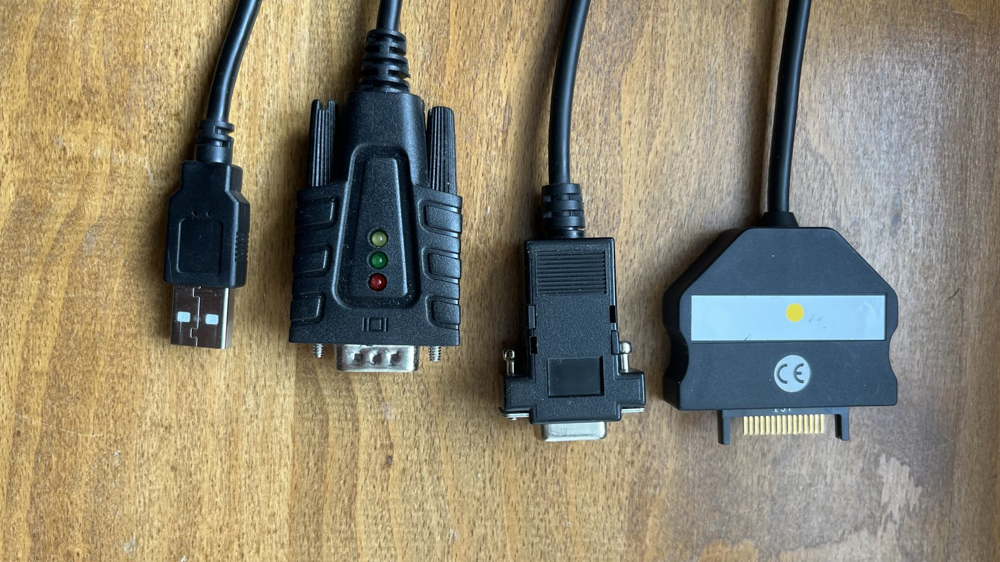
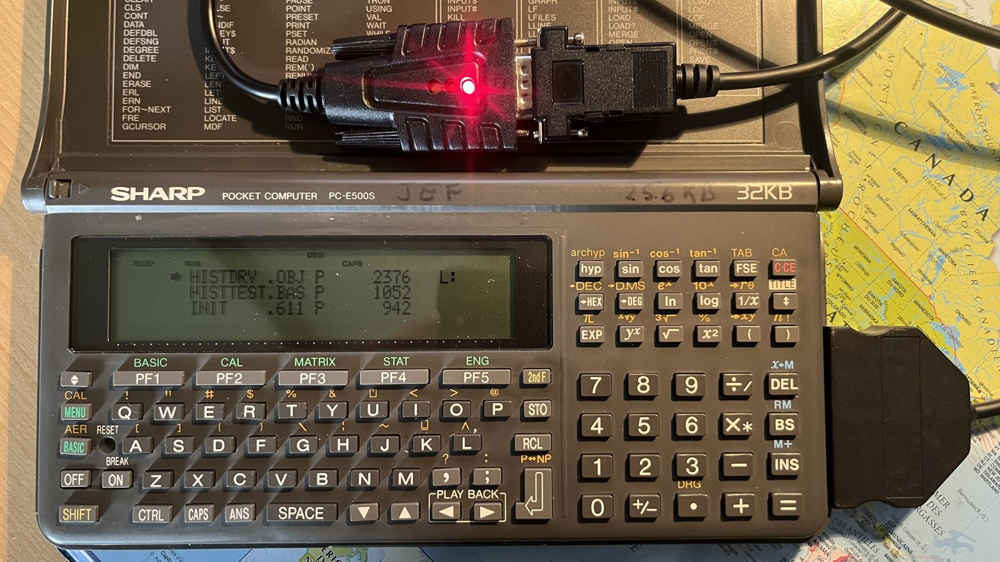
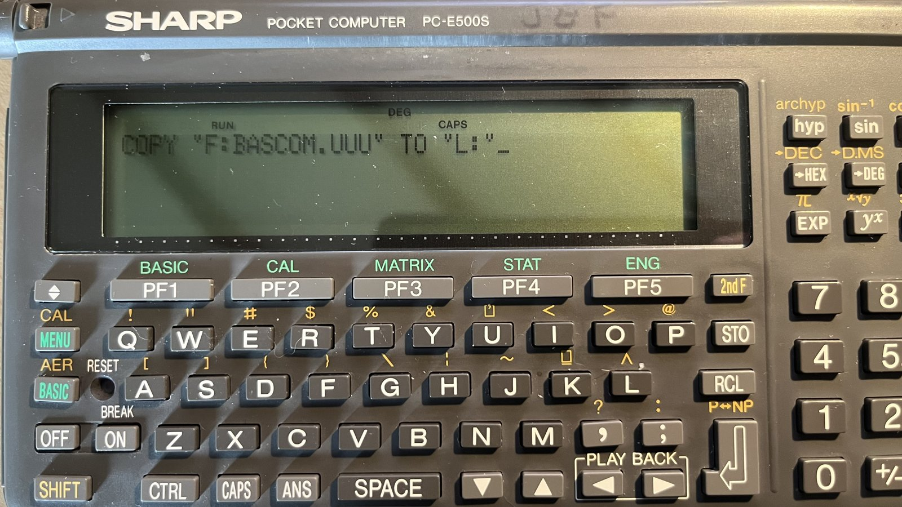
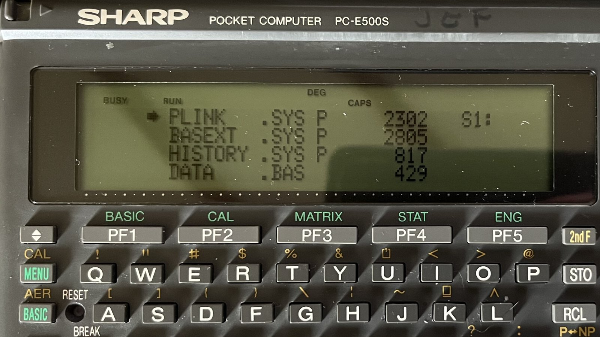
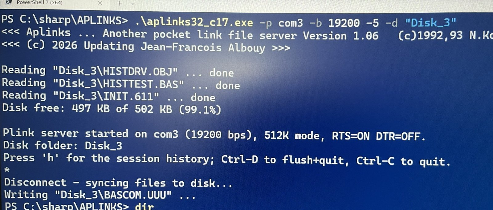
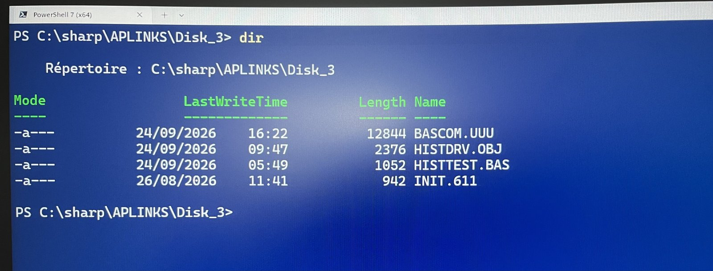

# Sharp PC-E500 — Pocket Link System (PLINK / PLINKC / APLINKS)

**🇬🇧 English** · [🇫🇷 Français](README.fr.md)

Preservation and modernization of the **Pocket Link System**, a family of 1990s
Japanese freeware that turns a **Sharp PC-E500 series** pocket computer into a
client of a PC over a serial cable. The pocket computer sees an ordinary disk
drive **`L:`** — but that drive has no physical storage: every sector read or
written is carried over the serial link to a small **server program running on
the PC**, where the files live as real files.

This repository keeps the **original author archives intact** (`original/`) and
adds a **modernized, portable server** that still talks to real hardware in 2026
(`modernized/`).

```
   Sharp PC-E500(S)                         PC (Windows / Linux / macOS)
  ┌────────────────┐   9600–19200 bps      ┌──────────────────────────┐
  │  BASIC + PLINKC │◄─── serial cable ───►│  APLINKS server          │
  │  driver  → L:   │   (sectors on wire)  │  L: files ⇄ PC folder    │
  └────────────────┘                        └──────────────────────────┘
```

---

## In action

Validated end-to-end on a real **Sharp PC-E500S** — a modern laptop standing in
as the disk drive the pocket computer never had.

<table>
  <tr>
    <td width="50%"><br><sub><b>The physical link.</b> USB → USB-serial adapter → gender/null-modem changer → the Sharp's 15-pin SIO connector. That whole chain is all the hardware you need.</sub></td>
    <td width="50%"><br><sub><b>Online.</b> The PC-E500S connected, the adapter's TX LED lit, showing a <code>FILES "L:"</code> listing served entirely from the PC.</sub></td>
  </tr>
  <tr>
    <td width="50%"><br><sub><b>On the pocket.</b> <code>COPY "F:BASCOM.UUU" TO "L:"</code> — a RAM-card file copied to the virtual drive, sector by sector over the wire.</sub></td>
    <td width="50%"><br><sub><b>The driver, resident.</b> <code>FILES</code> on the pocket with <code>PLINK.SYS</code> — the cache driver that creates the <code>L:</code> drive — loaded and running.</sub></td>
  </tr>
  <tr>
    <td width="50%"><br><sub><b>The modernized server.</b> <code>aplinks32</code> starting in <b>512 KB mode at 19200 bps</b> (RTS=ON), auto-loading a disk folder and reporting free space.</sub></td>
    <td width="50%"><br><sub><b>…and back on the PC.</b> The same files as ordinary, editable, backed-up files in the disk folder after the pocket disconnects.</sub></td>
  </tr>
</table>

---

## Why it still matters

A Sharp PC-E500 is a genuinely capable little machine — a real BASIC, a built-in
assembler, a proper keyboard — but its only window on the outside world is a
1980s serial port and RAM cards whose backup batteries are now decades past their
rated life. Getting code and data *on and off* it is the hard part. The Pocket
Link System solves exactly that, and this repository keeps it working on modern
computers:

- **A disk the pocket never had.** No floppy, no flash — yet `SAVE`, `LOAD`,
  `FILES` and `COPY` to `L:` just work, transparently, at up to 19200 bps. Your
  laptop *is* the drive.
- **Rescue before the battery dies.** Thirty-year-old BASIC programs and machine
  code sitting in volatile RAM are one dead cell away from gone. Here they become
  ordinary PC files — archived, versioned, safe — and can be pushed straight back.
- **Real hardware, modern host.** Not an emulator: the actual 1990s pocket
  computer, driven by a server that now builds and runs on today's Windows, Linux
  and macOS. A €10 USB-serial adapter is the only part you have to buy.
- **Edit where it's comfortable.** Write and refactor on the PC in a real editor,
  then load onto the pocket in seconds — the round trip is byte-for-byte faithful.
- **A protocol you can actually read.** The whole system — an 8-sector cache
  block-device driver and a compact serial wire protocol — is small enough to
  understand end to end, which makes it a rare, complete teaching example.
- **Free and open.** Freeware from the start; the originals are preserved intact
  and the modern server is offered in the same spirit.

---

## The story

The Pocket Link System was created by **N.Kon (近成人)** and first published in
the Japanese magazine *Pokecon Journal* in June 1990: a resident device driver
`PLINK.SYS` for the PC-E500 plus a companion PC server `PLINKM`. It has grown
through several authors over the years:

| Year | Component | Author | What it added |
|------|-----------|--------|---------------|
| 1990–94 | **PLINK** (`PLINK.SYS` + `PLINKM`) | N.Kon | The original driver, server and serial **wire protocol**. |
| 1992–93 | **APLINKS** (MS-DOS) | N.Kon | A server that exposes **real PC files directly** as the virtual disk (no single "filed-drive" image needed). |
| 1996–97 | **APLINKS for Win32** | Y.Akagawa | A Windows GUI port of APLINKS, with **512 KB** disk support. |
| 1996–99 | **PLINKC** ("Pocket Link **Cache**") | D.Mizobata | A faster driver: adds an **8-sector cache** to `PLINK.SYS` and supports the **512 KB** `L:` drive. Version 1.62 is the last. |
| 2026 | **APLINKS modernized** | J-F Albouy | This repo: the 1993 DOS server **ported to portable C** and extended — see below. |

All of it is freeware. The original archives are preserved here byte-for-byte;
see [`NOTICE`](NOTICE) for authors, copyrights and the exact license terms.

---

## What's in this repository

```
original/                     ← the untouched author archives (pristine)
├── PLINK-1.04-1994/          N.Kon    — driver + server + docs + SC62015 source
├── PLINKC-1.62-1999/         Mizobata — the cache driver (installer, BASIC, docs)
├── APLINKS-DOS-1.03-1993/    N.Kon    — the MS-DOS server (C source + EXE + docs)
└── APLINKS-Win32-1.02-1997/  Akagawa  — the Windows GUI server

modernized/
└── aplinks/                  ← 2026 derivative: the portable, extended server
    ├── APLINKS.C             C99 reference source (Win32 + POSIX)
    ├── APLINKS_C17.C         C17 readability variant (identical behavior)
    ├── aplinks32.exe         prebuilt Windows binary
    ├── aplinks32_c17.exe     prebuilt Windows binary (C17 build)
    ├── build.ps1 / build_c17.ps1 / Makefile
    └── README.md             full usage & troubleshooting guide (French)

NOTICE                        attribution + license terms + list of changes
CLAUDE.md                     deep technical notes (protocol, architecture, gotchas)
```

The `original/` archives are redistributed **unmodified**, exactly as their
freeware licenses permit. The `modernized/` server is a **clearly separated
derivative** of N.Kon's APLINKS; its on-wire protocol is byte-for-byte identical
to the original.

---

## The modernized server (2026)

`modernized/aplinks/` is N.Kon's 1993 DOS `APLINKS.C` **ported off `<dos.h>` to
ISO C** with a `#ifdef _WIN32` / POSIX platform layer, so it builds and runs on
current Windows, Linux and macOS. On top of the unchanged protocol it adds:

- **128 KB and 512 KB** disk modes (`-1` / `-5`, or auto-negotiated at `INIT`);
- a **disk-folder model** (`-d Folder`): a PC folder *is* the virtual disk — its
  files auto-load, and files the pocket saves are written back to it;
- **file timestamps**, **runtime serial options** (`-p`, `-b`, `--rts/--dtr`),
  **verbose logging** (`-v`, `-l`), **free-space** and **session-history** display;
- validated end-to-end on **real PC-E500 hardware**, 9600 and 19200 bps, 128K/512K,
  in both directions.

### Build

```sh
# Windows (MinGW-w64 gcc, clang, or MSVC)
gcc -x c -std=c99 -O2 -o aplinks32.exe APLINKS.C     # or:  .\build.ps1
# Linux / macOS
cc -std=c99 -O2 -o aplinks APLINKS.C                 # or:  make
```

*(The `.C` extension makes gcc/clang assume C++ — pass `-x c`.)*

### Run (quick start)

```
# PC:
aplinks32 -p com3 -b 19200 -5 -d "MyDisk"
# Pocket (BASIC):
OPEN "9600,N,8,1,A,L,&1A,N,N":CLOSE
INIT "L:5"
FILES "L:" : SAVE "L:PROG.BAS" : LOAD "L:PROG.BAS"
INIT "L:D"          ' disconnect + flush files to the PC folder
```

One non-obvious hardware detail: the PC must assert **RTS=ON** or the pocket
never transmits (its CS input is driven by the PC's RTS). The full usage and
troubleshooting guide — including S2 memory-card (`RAMFILE`) backup/restore — is
in **[`modernized/aplinks/README.md`](modernized/aplinks/README.md)** (French).

---

## Credits

- **N.Kon (近成人)** — PLINK / Pocket Link System and the wire protocol (1990–94);
  original APLINKS server (1992–93).
- **Daisuke Mizobata (溝端大介)** — PLINKC "Pocket Link Cache" driver (1996–99).
- **Y.Akagawa (赤川裕一)** — APLINKS for Win32 (1996–97).
- **Jean-François Albouy** — 2026 port and extensions of the APLINKS server.

## License

Each original component keeps its own 1990s freeware terms (redistribution of the
**unmodified** archive is permitted; no commercial sale). The 2026 derivative is
offered in good faith for a long-abandoned platform. Full details, per-author
copyrights, and a contact/removal statement are in **[`NOTICE`](NOTICE)**.
